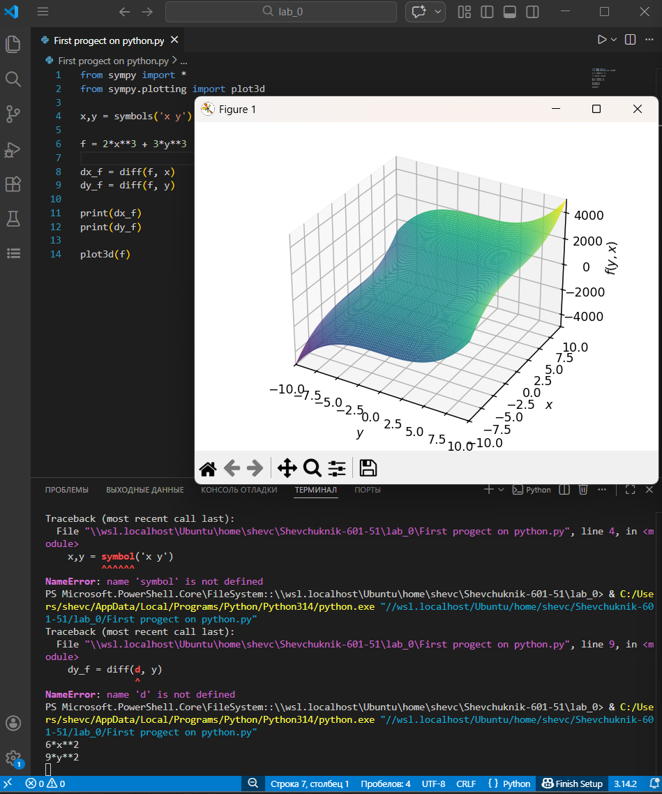

# **Отчет**
---
## *Задание*
---
 Вычисление частных производных с целью исследования уклонов относительно разных переменных в разных направлениях с помощью SymPy
---
## *Результаты вычислений*
---
1.Создаются символьные переменные x и y, необходимые для аналитических вычислений.
```x,y = symbols('x y')```
2.Определяется функция двух переменных f(x, y)
```f = 2*x**3 + 3*y**3```
3.Вычисление частных производных:
```dx_f = diff(f, x)```
```dy_f = diff(f, y)```
4.Вывод результатов и построение графика:
```print(dx_f)```
```print(dy_f)```
```plot3d(f)```


---
## *Список использованных источников:*
---
1.[https://ru.wikipedia.org/wiki/Частная_производная]
2.[Essential Math for Data Science] (https://www.oreilly.com/library/view/essential-math-for/9781098102920/)
3.[SymPy is a Python library](https://www.sympy.org/en/index.html)