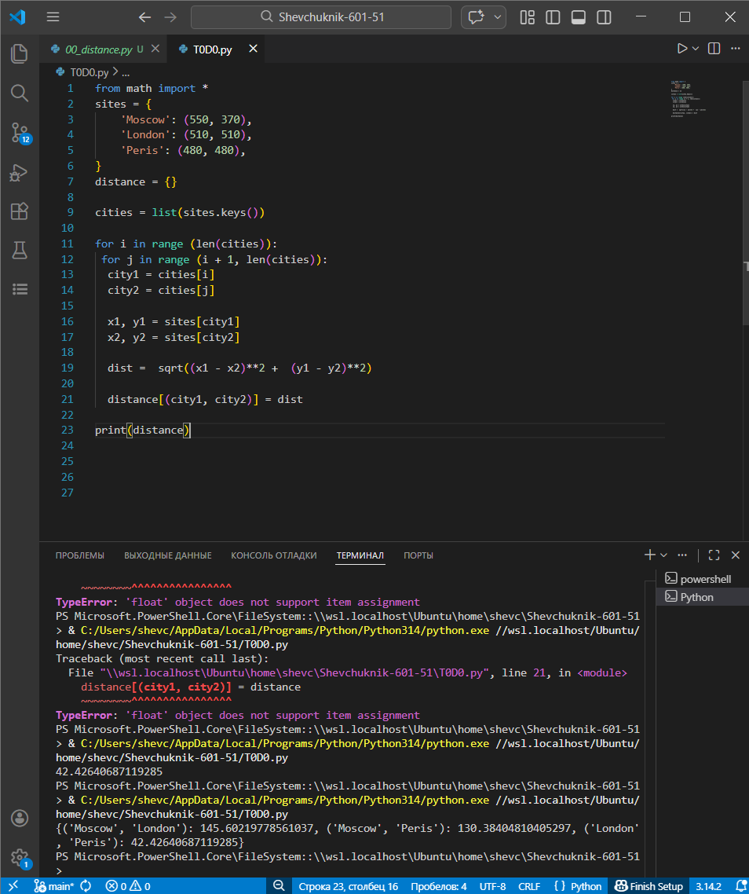

# **Отчет**
---
## *Задание*
---
## *Составить словарь словарей расстояний между городами с задаными координатами*
---
## *Результаты вычислений*
---
1. Объявление словаря и словаря для словаря с расчетами:
```python
sites = {
    'Moscow': (550, 370),
    'London': (510, 510),
    'Peris': (480, 480),
}
distance = {}
```
2. Достали списки и дали каждому ключ для дальнейшего обращения к элементам списка по ключам
```python
cities = list(sites.keys())
```
---
3. Перебор пар - i + 1 - это для разичный значений (чтобы не повторились)
```python
for i in range (len(cities)):
 for j in range (i + 1, len(cities)):
  city_1 = cities[i]
  city_2 = cities[j]
```
---
4. Для получения координат
```python
x1, y1 = (sites[city_1])
x2, y2 = (sites[city_2])
```
---
5. Вычислил растояние и повестил в словарь словарей
```python
dist =  sqrt((x1 - x2)**2 +  (y1 - y2)**2)
distance[(city_1, city_2)] = dist
```
---
6. Получил результат вычисления растояние между городами с помощью Евклидовой метрики в словаре
```python
print(distance)
```


---
## *Список использованных источников:*
---
1. [The Python Tutorial](https://docs.python.org/3/tutorial/)
2. [Essential Math for Data Science](https://www.oreilly.com/library/view/essential-math-for/9781098102920/)