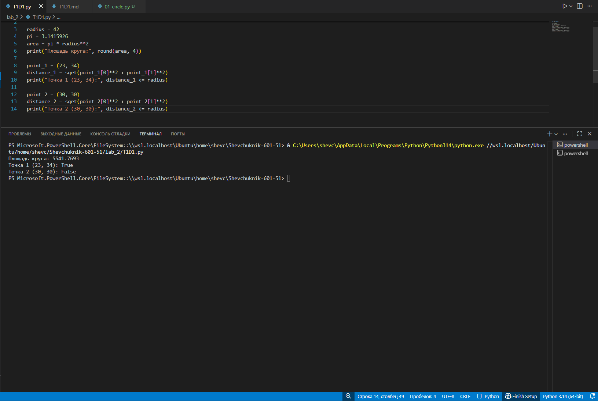

# **Отчет**

## *Задание_1*

### *Выведите на консоль значение прощади этого круга с точностю до 4-х знаков после запятой*
---
#### *Результаты вычислений*
```python
radius = 42
pi = 3.1415926
area = pi * radius**2
print("Площадь круга:", round(area, 4))
```
---
## *Задание_2*

### *Если точка point лежит внутри того самого круга [центр в начале координат (0, 0), radius = 42], то выведите на консоль True, или False, если точка лежит вовне круга*
---
#### *Результаты вычислений*
```python
point_1 = (23, 34)
distance_1 = sqrt(point_1[0]**2 + point_1[1]**2)
print("Точка 1 (23, 34):", distance_1 <= radius)
```
---
## *Задание_3*

### *Если точка point_2 лежит внутри круга (radius = 42), то выведите на консоль True, или False, если точка лежит вовне круга.*
---
#### *Результаты вычислений*
```python
point_2 = (30, 30)
distance_2 = sqrt(point_2[0]**2 + point_2[1]**2)
print("Точка 2 (30, 30):", distance_2 <= radius)
```


---
## *Список использованных источников:*

1. [The Python Tutorial](https://docs.python.org/3/tutorial/)
2. [Essential Math for Data Science](https://www.oreilly.com/library/view/essential-math-for/9781098102920/)