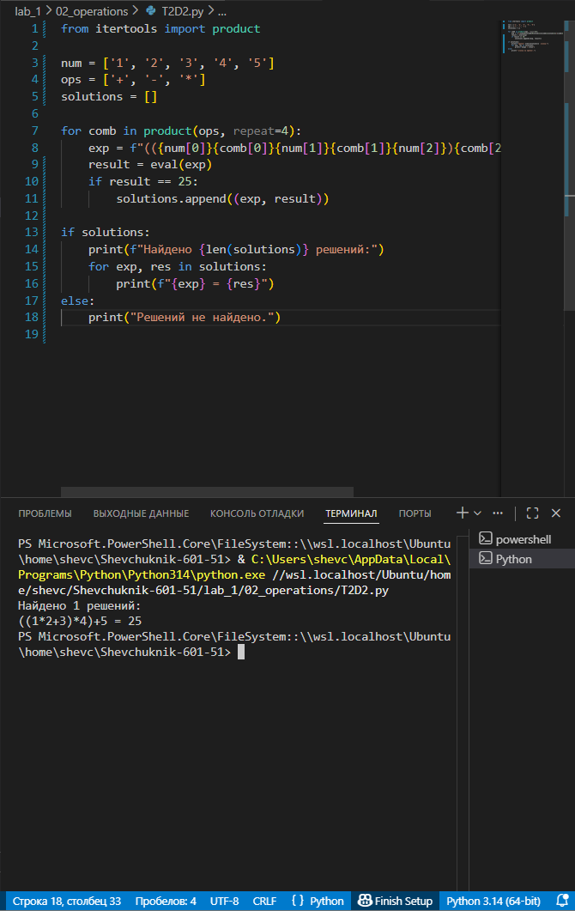

# **Отчёт**

## *Задание_4*

### Расставьте знаки операций "плюс", "минус", "умножение" и скобки между числами "1 2 3 4 5" так, что бы получилось число "25". Использовать нужно только указанные знаки операций, но не обязательно все перечесленные. Порядок чисел нужно сохранить.
---
#### *Результаты вычислений*
```python
from itertools import product

num = ['1', '2', '3', '4', '5']
ops = ['+', '-', '*']
solutions = []

for comb in product(ops, repeat=4):
    exp = f"(({num[0]}{comb[0]}{num[1]}{comb[1]}{num[2]}){comb[2]}{num[3]}){comb[3]}{num[4]}"
    result = eval(exp)
    if result == 25:
        solutions.append((exp, result))

if solutions:
    print(f"Найдено {len(solutions)} решений:")
    for exp, res in solutions:
        print(f"{exp} = {res}")
else:
    print("Решений не найдено.")
```
---

---
## *Список использованных источников:*

1. [The Python Tutorial — itertools](https://docs.python.org/3/library/itertools.html)
2. [Python Documentation — Built‑in Functions (eval)](https://docs.python.org/3/library/functions.html#eval)