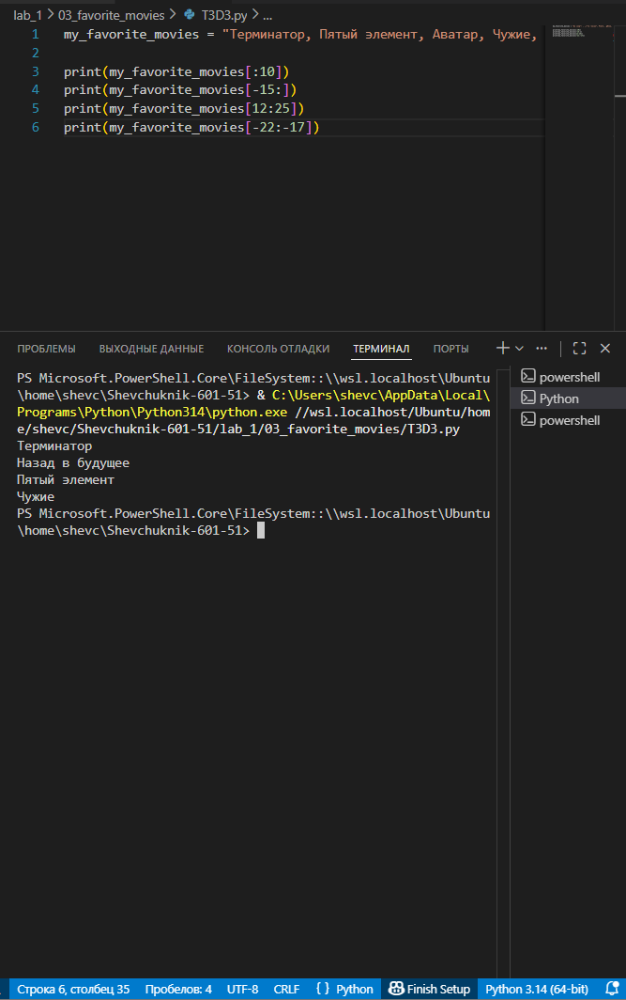

# **Отчёт**

## *Задание_4*

### Есть строка с перечислением фильмов:
my_favorite_movies = 'Терминатор, Пятый элемент, Аватар, Чужие, Назад в будущее'
1. Выведите на консоль с помощью индексации строки, последовательно:
- первый фильм
- последний
- второй
- второй с конца
2. Запятая не должна выводиться. 
3. Переопределять my_favorite_movies нельзя
4. Использовать .split() или .find()или другие методы строки нельзя - пользуйтесь только срезами, как указано в задании!
---
#### *Результаты вычислений*
```python
my_favorite_movies = "Терминатор, Пятый элемент, Аватар, Чужие, Назад в будущее"

print(my_favorite_movies[:10])
print(my_favorite_movies[-15:])
print(my_favorite_movies[12:25])
print(my_favorite_movies[-22:-17])
```
---

---
## *Список использованных источников:*

1. [The Python Tutorial — Strings](https://docs.python.org/3/tutorial/introduction.html#strings)  
2. [Python Documentation — Sequence Types — str](https://docs.python.org/3/library/stdtypes.html#textseq)  
3. [Python Strings and Character Data — String Indexing and Slicing](https://realpython.com/python-strings/#string-indexing-and-slicing)  
4. [Python Basics — Working with Strings](https://www.w3schools.com/python/python_strings.asp)  