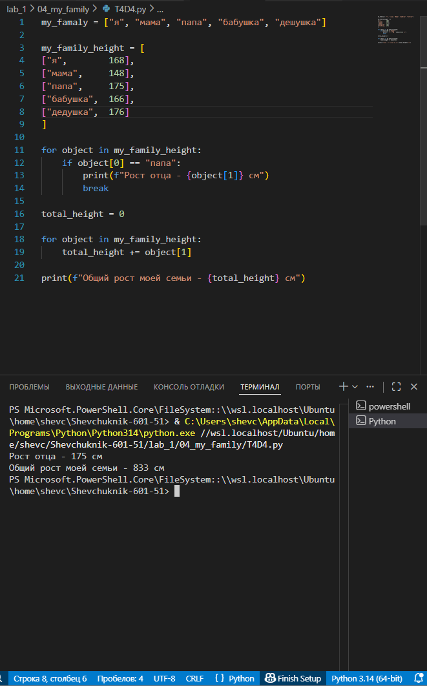

# **Отчёт**

## *Задание_4*

### Создайте списки:
1. Моя семья (минимум 3 элемента, есть еще дедушки и бабушки, если что).
2. Список списков приблизителного роста членов вашей семьи.
3. Выведите на консоль рост отца в формате: Рост отца - ХХ см
4. Выведите на консоль общий рост вашей семьи как сумму ростов всех членов Общий рост моей семьи - ХХ см
---
#### *Результаты вычислений*
```python
my_family = ["я", "мама", "папа", "бабушка", "дедушка"]

my_family_height = [
    ["я",        168],
    ["мама",     148],
    ["папа",     175],
    ["бабушка",  166],
    ["дедушка",  176]
]

for object in my_family_height:
    if object[0] == "папа":
        print(f"Рост отца - {object[1]} см")
        break

total_height = 0

for object in my_family_height:
    total_height += object[1]

print(f"Общий рост моей семьи - {total_height} см")
```
---

---
## *Список использованных источников:*

1. [The Python Tutorial — Data Structures](https://docs.python.org/3/tutorial/datastructures.html)
2. [Python Documentation — Built‑in Types](https://docs.python.org/3/library/stdtypes.html)
3. [Python f‑strings: An Improved String Formatting Syntax (Guide)](https://realpython.com/python-f-strings/)