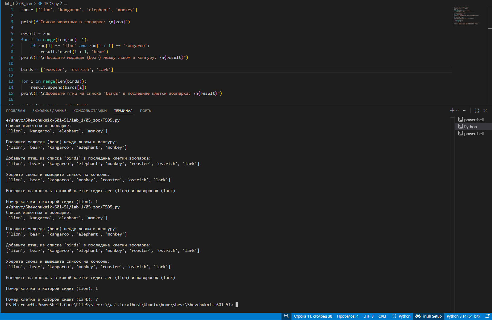

# **Отчёт**

## *Задание_4*

### # есть список животных в зоопарке:
zoo = ['lion', 'kangaroo', 'elephant', 'monkey', ]
1. посадите медведя (bear) между львом и кенгуру и выведите список на консоль
2. добавьте птиц из списка birds в последние клетки зоопарка
birds = ['rooster', 'ostrich', 'lark', ] и выведите список на консоль
3. уберите слона и выведите список на консоль
4. выведите на консоль в какой клетке сидит лев (lion) и жаворонок (lark).
5. Номера при выводе должны быть понятны простому человеку, не программисту.
---
#### *Результаты вычислений*
```python
zoo = ['lion', 'kangaroo', 'elephant', 'monkey']

print(f"Список животных в зоопарке: \n{zoo}")

result = zoo
for i in range(len(zoo) - 1):
    if zoo[i] == 'lion' and zoo[i + 1] == 'kangaroo':
        result.insert(i + 1, 'bear')
print(f"\nПосадите медведя (bear) между львом и кенгуру: \n{result}")

birds = ['rooster', 'ostrich', 'lark']

for i in range(len(birds)):
    result.append(birds[i])
print(f"\nДобавьте птиц из списка 'birds' в последние клетки зоопарка: \n{result}")

value_to_remove = 'elephant'
while value_to_remove in result:
    result.remove(value_to_remove)
print(f"\nУберите слона и выведите список на консоль: \n{result}")

def find_Animal(list, target):
    for i in range(len(list)):
        if list[i] == target:
            return i + 1

print(f"\nВыведите на консоль, в какой клетке сидит лев (lion) и жаворонок (lark)")
print(f"\nНомер клетки, в которой сидит (lion): {find_Animal(result, 'lion')}")
print(f"\nНомер клетки, в которой сидит (lark): {find_Animal(result, 'lark')}")
```
---

---
## *Список использованных источников:*

1. [The Python Tutorial — Data Structures](https://docs.python.org/3/tutorial/datastructures.html)  
2. [Python Documentation — Built‑in Types (lists)](https://docs.python.org/3/library/stdtypes.html#typesseq-list)  
3. [Python f‑strings: An Improved String Formatting Syntax (Guide)](https://realpython.com/python-f-strings/)  
4. [Python Functions — Defining Your Own](https://docs.python.org/3/tutorial/controlflow.html#defining-functions)  