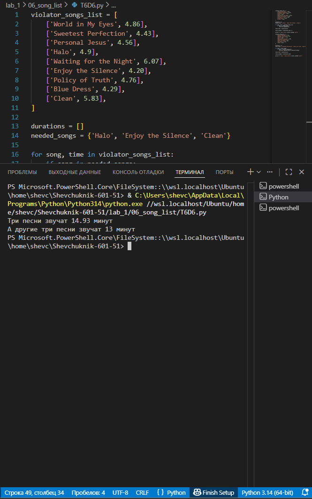

# **Отчёт**

## *Задание_4*

### # Есть список песен группы Depeche Mode со временем звучания с точностью до долей минут:
1. Точность указывается в функции round(a, b), где a, это число которое надо округлить, а b количество знаков после запятой более подробно про функцию round смотрите в документации https://docs.python.org/3/search.html?q=round
2. распечатайте общее время звучания трех песен: 'Halo', 'Enjoy the Silence' и 'Clean' в формате: Три песни звучат ХХХ.XX минут
3. Обратите внимание, что делать много вычислений внутри print() - плохой стиль.
4. Лучше заранее вычислить необходимое, а затем в print(xxx, yyy, zzz)
### Есть словарь песен группы Depeche Mode:
1. распечатайте общее время звучания трех песен: 'Sweetest 
2. Perfection', 'Policy of Truth' и 'Blue Dress' 
3. А другие три песни звучат ХХХ минут
---
#### *Результаты вычислений*
```python
violator_songs_list = [
    ['World in My Eyes', 4.86],
    ['Sweetest Perfection', 4.43],
    ['Personal Jesus', 4.56],
    ['Halo', 4.9],
    ['Waiting for the Night', 6.07],
    ['Enjoy the Silence', 4.20],
    ['Policy of Truth', 4.76],
    ['Blue Dress', 4.29],
    ['Clean', 5.83],
]

durations = []
needed_songs = {'Halo', 'Enjoy the Silence', 'Clean'}

for song, time in violator_songs_list:
    if song in needed_songs:
        durations.append(time)

total_time = sum(durations)
total_rounded = round(total_time, 2)
print(f"Три песни звучат {total_rounded} минут")

violator_songs_dict = {
    'World in My Eyes': 4.76,
    'Sweetest Perfection': 4.43,
    'Personal Jesus': 4.56,
    'Halo': 4.30,
    'Waiting for the Night': 6.07,
    'Enjoy the Silence': 4.6,
    'Policy of Truth': 4.88,
    'Blue Dress': 4.18,
    'Clean': 5.68,
}

durations = []
other_songs = ['Sweetest Perfection', 'Policy of Truth', 'Blue Dress']

for song in other_songs:
    if song in violator_songs_dict:
        durations.append(violator_songs_dict[song])

total_time = sum(durations)
total_rounded = round(total_time)
print(f"А другие три песни звучат {total_rounded} минут")
```
---

---
## *Список использованных источников:*

1. [The Python Tutorial — Data Structures (lists, dictionaries)](https://docs.python.org/3/tutorial/datastructures.html)  
2. [Python Documentation — Built‑in Functions (sum, round)](https://docs.python.org/3/library/functions.html#sum)  
3. [Python Sets — How to Use Sets in Python](https://realpython.com/python-sets/)  
4. [Python f‑strings: An Improved String Formatting Syntax (Guide)](https://realpython.com/python-f-strings/)  
5. [Working with Dictionaries in Python](https://www.w3schools.com/python/python_dictionaries.asp)  