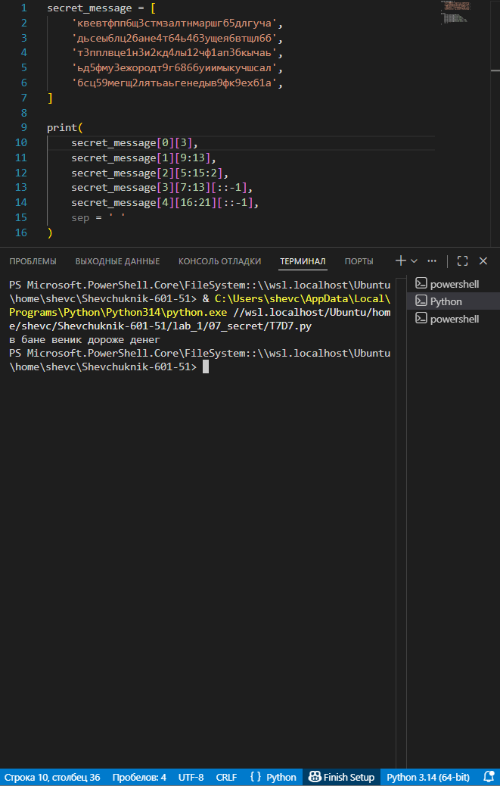

# **Отчёт**

## *Задание_4*

### # Есть зашифрованное сообщение:
secret_message = [
    'квевтфпп6щ3стмзалтнмаршгб5длгуча',
    'дьсеы6лц2бане4т64ь4б3ущея6втщл6б',
    'т3пплвце1н3и2кд4лы12чф1ап3бкычаь',
    'ьд5фму3ежородт9г686буиимыкучшсал',
    'бсц59мегщ2лятьаьгенедыв9фк9ехб1а',
]
1. Нужно его расшифровать и вывести на консоль в удобочитаемом виде.
2. Должна получиться фраза на русском языке, например: как два байта переслать.
3. Ключ к расшифровке:
- первое слово - 4-я буква
- второе слово - буквы с 10 по 13, включительно
- третье слово - буквы с 6 по 15, включительно, через одну
- четвертое слово - буквы с 8 по 13, включительно, в обратном порядке
- пятое слово - буквы с 17 по 21, включительно, в обратном порядке
4. Обратите вниманме:
- даны номера букв, а не индексы
- срез не включает последний индекс
- подробную информацию об обратных срезах см https://clck.ru/MfEMS
5. Подсказки:
- В каждом элементе списка защифровано одно слово.
- Требуется задать конкретные индексы, например secret_message[3][12:23:4]
- 4е и 5е слова нужно получить за 1 срез
- Если нужны вычисления и разные пробы - делайте это в консоли пайтона, тут нужен только результат
---
#### *Результаты вычислений*
```python
secret_message = [
    'квевтфпп6щ3стмзалтнмаршгб5длгуча',
    'дьсеы6лц2бане4т64ь4б3ущея6втщл6б',
    'т3пплвце1н3и2кд4лы12чф1ап3бкычаь',
    'ьд5фму3ежородт9г686буиимыкучшсал',
    'бсц59мегщ2лятьаьгенедыв9фк9ехб1а',
]

print(
    secret_message[0][3],          
    secret_message[1][9:13],      
    secret_message[2][5:15:2],    
    secret_message[3][7:13][::-1],   
    secret_message[4][16:21][::-1],
    sep = ' '
)
```
---

---
## *Список использованных источников:*

1. [The Python Tutorial — Strings and Lists](https://docs.python.org/3/tutorial/introduction.html#strings)  
2. [Python Documentation — Common Sequence Operations](https://docs.python.org/3/library/stdtypes.html#common-sequence-operations)  
3. [Python Strings — Indexing and Slicing](https://realpython.com/python-strings/#string-indexing-and-slicing)  
4. [W3Schools Python Lists](https://www.w3schools.com/python/python_lists.asp)  
5. [GeeksforGeeks — String Slicing in Python](https://www.geeksforgeeks.org/string-slicing-in-python/)