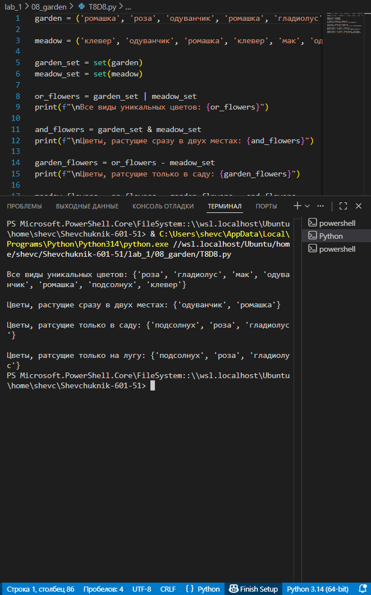

# **Отчёт**

## *Задание_4*

### В саду сорвали цветы:
garden = ('ромашка', 'роза', 'одуванчик', 'ромашка', 'гладиолус', 'подсолнух', 'роза')
### На лугу сорвали цветы:
meadow = ('клевер', 'одуванчик', 'ромашка', 'клевер', 'мак', 'одуванчик', 'ромашка')
1. Создайте множество цветов, произрастающих в саду и на лугу
- garden_set =
- meadow_set =
2. Выведите на консоль все виды цветов
3. Выведите на консоль те, которые растут и там и там
4. Выведите на консоль те, которые растут в саду, но не растут на лугу
5. Выведите на консоль те, которые растут на лугу, но не растут в саду
---
#### *Результаты вычислений*
```python
garden = ('ромашка', 'роза', 'одуванчик', 'ромашка', 'гладиолус', 'подсолнух', 'роза')

meadow = ('клевер', 'одуванчик', 'ромашка', 'клевер', 'мак', 'одуванчик', 'ромашка')

garden_set = set(garden)
meadow_set = set(meadow)

or_flowers = garden_set | meadow_set
print(f"\nВсе виды уникальных цветов: {or_flowers}")

and_flowers = garden_set & meadow_set
print(f"\nЦветы, растущие сразу в двух местах: {and_flowers}")

garden_flowers = or_flowers - meadow_set
print(f"\nЦветы, растущие только в саду: {garden_flowers}")

meadow_flowers = or_flowers - garden_flowers - and_flowers
print(f"\nЦветы, растущие только на лугу: {meadow_flowers}")
```
---

---
## *Список использованных источников:*

1. [The Python Tutorial — Data Structures (Sets)](https://docs.python.org/3/tutorial/datastructures.html#sets)  
2. [Python Documentation — Built‑in Types (set)](https://docs.python.org/3/library/stdtypes.html#set)  
3. [Python Sets — How to Use Sets in Python](https://realpython.com/python-sets/)  
4. [W3Schools Python Sets](https://www.w3schools.com/python/python_sets.asp)  
5. [GeeksforGeeks — Python Sets](https://www.geeksforgeeks.org/python-sets/)