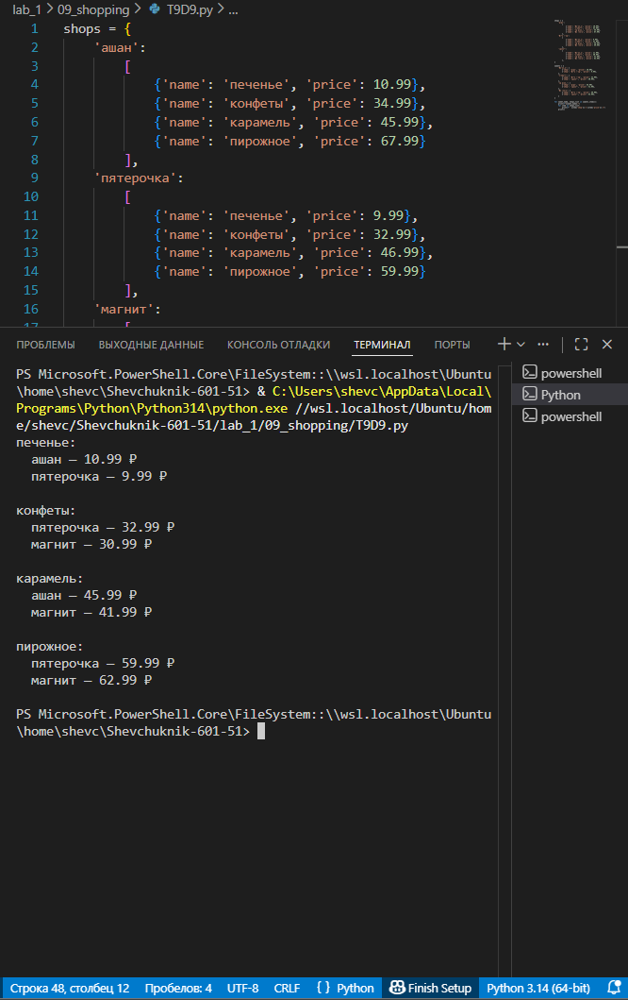

# **Отчёт**

## *Задание_4*

### Есть словарь магазинов с распродажами:
- shops = {}
1. Создайте словарь цен на продкты следующего вида (писать прямо в коде)
sweets = {
    'название сладости': [
        {'shop': 'название магазина', 'price': 99.99},
        TODO тут с клавиатуры введите магазины и цены (можно копипастить ;)
    ],
    TODO тут с клавиатуры введите другую сладость и далее словарь магазинов
}
2. Указать надо только по 2 магазина с минимальными ценами
---
#### *Результаты вычислений*
```python
shops = {
    'ашан':
        [
            {'name': 'печенье', 'price': 10.99},
            {'name': 'конфеты', 'price': 34.99},
            {'name': 'карамель', 'price': 45.99},
            {'name': 'пирожное', 'price': 67.99}
        ],
    'пятерочка':
        [
            {'name': 'печенье', 'price': 9.99},
            {'name': 'конфеты', 'price': 32.99},
            {'name': 'карамель', 'price': 46.99},
            {'name': 'пирожное', 'price': 59.99}
        ],
    'магнит':
        [
            {'name': 'печенье', 'price': 11.99},
            {'name': 'конфеты', 'price': 30.99},
            {'name': 'карамель', 'price': 41.99},
            {'name': 'пирожное', 'price': 62.99}
        ],
}

sweets = {
    'печенье': [
        {'shop': 'ашан', 'price': 10.99},
        {'shop': 'пятерочка', 'price': 9.99},
    ],
    'конфеты': [
        {'shop': 'пятерочка', 'price': 32.99},
        {'shop': 'магнит', 'price': 30.99},
    ],
    'карамель': [
        {'shop': 'ашан', 'price': 45.99},
        {'shop': 'магнит', 'price': 41.99},
    ],
    'пирожное': [
        {'shop': 'пятерочка', 'price': 59.99},
        {'shop': 'магнит', 'price': 62.99},
    ]
}

for sweet_name, shops_list in sweets.items():
    print(f"{sweet_name}:")
    for item in shops_list:
        print(f"  {item['shop']} — {item['price']} ₽")
    print()
```
---

---
## *Список использованных источников:*

1. [The Python Tutorial — Data Structures (Dictionaries and Lists)](https://docs.python.org/3/tutorial/datastructures.html)  
2. [Python Documentation — Built‑in Types (dict, list)](https://docs.python.org/3/library/stdtypes.html#mapping-types-dict)  
3. [Python f‑strings: An Improved String Formatting Syntax (Guide)](https://realpython.com/python-f-strings/)  
4. [Working with Dictionaries in Python](https://www.w3schools.com/python/python_dictionaries.asp)  
5. [Real Python — Iterating Over Dictionaries](https://realpython.com/iterate-through-dictionary-python/)  