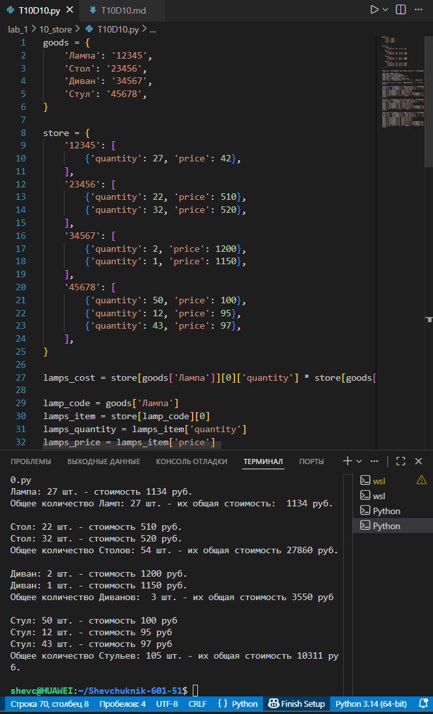

# **Отчёт**

## *Задание_4*

### *Рассчитайте и выведите на консоль количество и стоимость товаров в магазине по категориям (лампы, столы, диваны, стулья). Используйте словари goods (сопоставление названия товара и его кода) и store (данные о количестве и цене по кодам товаров). Для каждой категории:*
* *выведите информацию по каждой партии товара: количество штук и цена за единицу;*
* *подсчитайте общее количество товаров и их суммарную стоимость;*
* *оформите вывод в структурированном виде с пояснениями для каждой строки.*
---
#### *Результаты вычислений*
```python
goods = {
    'Лампа': '12345',
    'Стол': '23456',
    'Диван': '34567',
    'Стул': '45678',
}

store = {
    '12345': [
        {'quantity': 27, 'price': 42},
    ],
    '23456': [
        {'quantity': 22, 'price': 510},
        {'quantity': 32, 'price': 520},
    ],
    '34567': [
        {'quantity': 2, 'price': 1200},
        {'quantity': 1, 'price': 1150},
    ],
    '45678': [
        {'quantity': 50, 'price': 100},
        {'quantity': 12, 'price': 95},
        {'quantity': 43, 'price': 97},
    ],
}

lamp_code = goods['Лампа']
lamps_item = store[lamp_code][0]
lamps_quantity = lamps_item['quantity']
lamps_price = lamps_item['price']
lamps_cost = lamps_quantity * lamps_price
print('Лампа:', lamps_quantity, 'шт. - стоимость', lamps_cost, 'руб.')
print('Общее количество ламп:', lamps_quantity, 'шт. - их общая стоимость:', lamps_cost, 'руб.')
print()

table_code = goods['Стол']
tables_batch_1 = store[table_code][0]
tables_batch_2 = store[table_code][1]

print('Стол:', tables_batch_1['quantity'], 'шт. - стоимость', tables_batch_1['price'], 'руб.')
print('Стол:', tables_batch_2['quantity'], 'шт. - стоимость', tables_batch_2['price'], 'руб.')

total_tables_quantity = tables_batch_1['quantity'] + tables_batch_2['quantity']
total_tables_cost = (tables_batch_1['quantity'] * tables_batch_1['price'] +
                   tables_batch_2['quantity'] * tables_batch_2['price'])
print('Общее количество столов:', total_tables_quantity, 'шт. - их общая стоимость', total_tables_cost, 'руб.')
print()

sofa_code = goods['Диван']
sofas_batch_1 = store[sofa_code][0]
sofas_batch_2 = store[sofa_code][1]

print('Диван:', sofas_batch_1['quantity'], 'шт. - стоимость', sofas_batch_1['price'], 'руб.')
print('Диван:', sofas_batch_2['quantity'], 'шт. - стоимость', sofas_batch_2['price'], 'руб.')

total_sofas_quantity = sofas_batch_1['quantity'] + sofas_batch_2['quantity']
total_sofas_cost = (sofas_batch_1['quantity'] * sofas_batch_1['price'] +
                 sofas_batch_2['quantity'] * sofas_batch_2['price'])
print('Общее количество диванов:', total_sofas_quantity, 'шт. - их общая стоимость', total_sofas_cost, 'руб.')
print()

chair_code = goods['Стул']
chairs_batch_1 = store[chair_code][0]
chairs_batch_2 = store[chair_code][1]
chairs_batch_3 = store[chair_code][2]

print('Стул:', chairs_batch_1['quantity'], 'шт. - стоимость', chairs_batch_1['price'], 'руб.')
print('Стул:', chairs_batch_2['quantity'], 'шт. - стоимость', chairs_batch_2['price'], 'руб.')
print('Стул:', chairs_batch_3['quantity'], 'шт. - стоимость', chairs_batch_3['price'], 'руб.')

total_chairs_quantity = (chairs_batch_1['quantity'] + chairs_batch_2['quantity'] +
                     chairs_batch_3['quantity'])
total_chairs_cost = (chairs_batch_1['quantity'] * chairs_batch_1['price'] +
                 chairs_batch_2['quantity'] * chairs_batch_2['price'] +
                 chairs_batch_3['quantity'] * chairs_batch_3['price'])
print('Общее количество стульев:', total_chairs_quantity, 'шт. - их общая стоимость', total_chairs_cost, 'руб.')
print()
```
---

---
## *Список использованных источников:*

1. [The Python Tutorial — Data Structures (Dictionaries and Lists)](https://docs.python.org/3/tutorial/datastructures.html)  
2. [Python Documentation — Built‑in Types (dict, list)](https://docs.python.org/3/library/stdtypes.html#mapping-types-dict)  
3. [Python f‑strings and String Formatting](https://realpython.com/python-f-strings/)  
4. [Working with Dictionaries in Python](https://www.w3schools.com/python/python_dictionaries.asp)  
5. [GeeksforGeeks — Python Dictionary Operations](https://www.geeksforgeeks.org/python-dictionary/)