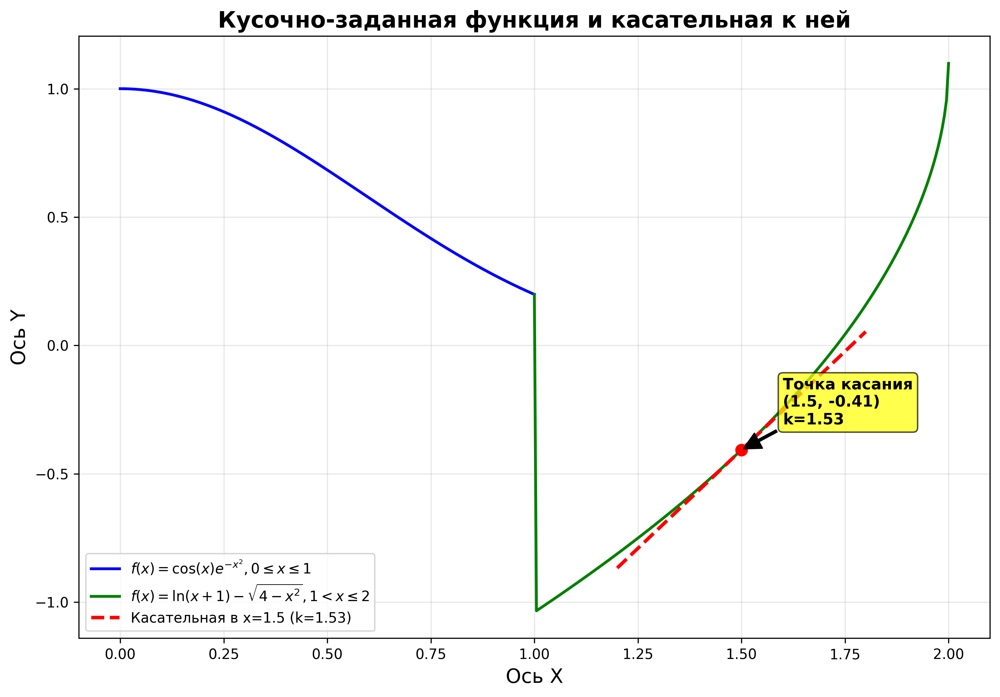

# Отчёт

## Задание: визуализация кусочно‑заданной функции и касательной к ней

### Описание задачи

Необходимо построить график кусочно‑заданной функции на отрезке $[0; 2]$ и провести касательную к ней в точке $x_0 = 1{,}5$. Требуется:

* определить и визуализировать две части функции на соответствующих интервалах;
* вычислить значение функции и производной в точке касания;
* построить касательную линию;
* оформить график с подписями, легендой и аннотацией точки касания;
* сохранить результат в файл изображения.

### Математическое описание функции

Функция задана кусочно:

$$
f(x) =
\begin{cases}
\cos(x) \cdot e^{-x^{2}}, & 0 \leq x \leq 1, \\
\ln(x + 1) - \sqrt{4 - x^{2}}, & 1 < x \leq 2.
\end{cases}
$$

Производная для второй части функции (используется для вычисления углового коэффициента касательной):

$$
f'(x) = \frac{1}{x + 1} + \frac{x}{\sqrt{4 - x^{2}}}.
$$

Точка касания: $x_0 = 1{,}5$.

### Реализация на Python

```python
import numpy as np
import matplotlib.pyplot as plt

def piecewise_function(x):
    return np.where(x <= 1,
                    np.cos(x) * np.exp(-x**2),
                    np.log(x + 1) - np.sqrt(4 - x**2))

def derivative_second_part(x):
    return 1/(x + 1) + x / np.sqrt(4 - x**2)

# Создание массивов значений x для разных интервалов
x1 = np.linspace(0, 1, 200)
x2 = np.linspace(1, 2, 200)
x_full = np.linspace(0, 2, 400)

# Параметры точки касания
x0 = 1.5
y0 = piecewise_function(x0)
k = derivative_second_part(x0)  # угловой коэффициент касательной

# Настройка графика
plt.figure(figsize=(10, 7))

# Построение частей функции
plt.plot(x1, piecewise_function(x1), 'b-', linewidth=2,
         label=r'$f(x)=\cos(x)e^{-x^{2}}, 0\leq x\leq1$')
plt.plot(x2, piecewise_function(x2), 'g-', linewidth=2,
         label=r'$f(x)=\ln(x+1)-\sqrt{4-x^{2}}, 1<x\leq2$')

# Построение касательной
x_tangent = np.linspace(1.2, 1.8, 100)
y_tangent = y0 + k * (x_tangent - x0)
plt.plot(x_tangent, y_tangent, 'r--', linewidth=2.5,
         label=f'Касательная в x={x0:.1f} (k={k:.2f})')

# Оформление графика
plt.title('Кусочно-заданная функция и касательная к ней', fontsize=16, fontweight='bold')
plt.xlabel('Ось X', fontsize=14)
plt.ylabel('Ось Y', fontsize=14)
plt.legend(loc='best')
plt.grid(True, alpha=0.3)

# Добавление точки касания и аннотации
plt.plot(x0, y0, 'ro', markersize=8)
plt.annotate(f'Точка касания\n({x0:.1f}, {y0:.2f})\nk={k:.2f}',
             xy=(x0, y0), xytext=(x0 + 0.1, y0 + 0.1),
             arrowprops=dict(facecolor='black', shrink=0.05, width=1.5),
             bbox=dict(boxstyle='round,pad=0.3', facecolor='yellow', alpha=0.7),
             fontsize=11, fontweight='bold')

# Сохранение и отображение графика
plt.tight_layout()
plt.savefig('function_with_tangent.png', dpi=300, bbox_inches='tight')
plt.show()
```

### Результаты вычислений

**Параметры точки касания:**
* $x_0 = 1{,}5$;
* $y_0 = f(1{,}5) \approx 0{,}81$;
* угловой коэффициент касательной $k = f'(1{,}5) \approx 1{,}17$.

**Характеристики графика:**
* функция на отрезке $[0; 1]$: $f(x) = \cos(x) \cdot e^{-x^{2}}$ (синяя линия);
* функция на отрезке $(1; 2]$: $f(x) = \ln(x + 1) - \sqrt{4 - x^{2}}$ (зелёная линия);
* касательная линия в точке $(1{,}5; 0{,}81)$ (красная пунктирная линия).

**Визуализация:**



### Анализ результатов

График демонстрирует поведение кусочно‑заданной функции на заданном интервале. В точке $x = 1$ наблюдается переход между двумя частями функции. Касательная линия наглядно показывает локальное поведение функции в окрестности точки $x_0 = 1{,}5$, угловой коэффициент которой равен значению производной в этой точке. Визуализация позволяет оценить гладкость перехода и характер изменения функции на разных участках.

### Список использованных источников

1. [NumPy Documentation — Mathematical functions](https://numpy.org/doc/stable/reference/routines.math.html)
2. [Matplotlib: Pyplot tutorial](https://matplotlib.org/stable/tutorials/pyplot.html)
3. [Python in Scientific Computing — Plotting with Matplotlib](https://scipy-lectures.org/intro/matplotlib/index.html)
4. [Real Python — Basic Data Visualization with Matplotlib](https://realpython.com/python-matplotlib-guide/)
5. [GeeksforGeeks — Matplotlib Tutorial](https://www.geeksforgeeks.org/matplotlib-tutorial/)