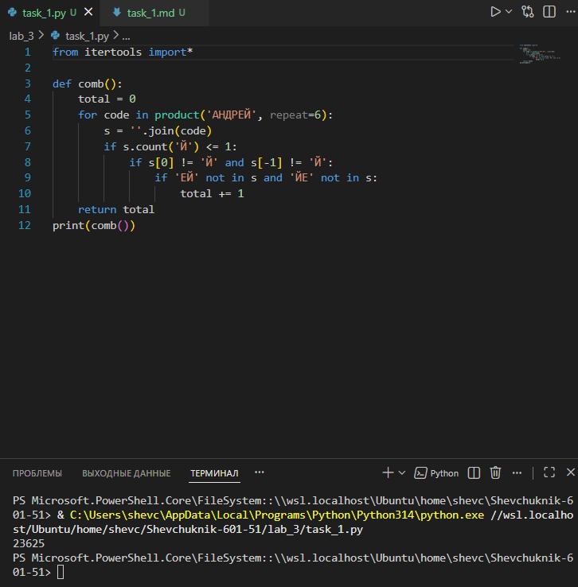

# Отчёт

## Задание_1

### Условие задачи
Андрей составляет 6‑буквенные коды из букв А, Н, Д, Р, Е, Й. При этом:
* буква Й может использоваться не более одного раза;
* буква Й не может стоять на первом и последнем месте;
* сочетания «ЕЙ» и «ЙЕ» не допускаются в коде.

Необходимо определить, сколько различных кодов может составить Андрей.

### Решение на языке Python

```python
from itertools import *

def comb():
    total = 0
    for code in product('АНДРЕЙ', repeat=6):
        s = ''.join(code)
        if s.count('Й') <= 1:  # Буква Й встречается не более одного раза
            if s[0] != 'Й' and s[-1] != 'Й':  # Й не на первом и не на последнем месте
                if 'ЕЙ' not in s and 'ЙЕ' not in s:  # Сочетания ЕЙ и ЙЕ отсутствуют
                    total += 1
    return total

# Вызываем функцию и выводим результат в терминал
print("Количество комбинаций:", comb())
```

### Результаты вычислений

После выполнения кода получаем следующий результат:

```
Количество комбинаций: 23625
```

### Пояснение логики решения

1. **Организация кода в виде функции**:
   * Создана функция `comb()`, которая инкапсулирует логику подсчёта допустимых комбинаций. Это повышает модульность и удобство повторного использования кода.
   * Функция возвращает итоговое количество комбинаций (`total`), а вывод результата осуществляется отдельной командой `print()`.

2. **Генерация всех возможных комбинаций**:
   * Используется функция `product` из модуля `itertools` с параметром `repeat=6` — это позволяет получить все возможные 6‑буквенные комбинации из заданного набора букв.
   * Алфавит: «АНДРЕЙ» (6 букв). Без ограничений общее число комбинаций составило бы $6^6 = 46656$.

3. **Применение ограничений**:
   * `s.count('Й') <= 1` — отбираются комбинации, где буква «Й» встречается 0 или 1 раз.
   * `s[0] != 'Й' and s[-1] != 'Й'` — исключаются комбинации, где «Й» стоит на первой или последней позиции.
   * `'ЕЙ' not in s and 'ЙЕ' not in s` — исключаются комбинации, содержащие запрещённые сочетания букв.

4. **Подсчёт допустимых комбинаций**:
   * Для каждой комбинации, удовлетворяющей всем условиям, переменная `total` увеличивается на 1.
   * После завершения цикла функция возвращает значение `total`.
   * В основной части программы результат выводится в консоль с поясняющей фразой.

5. **Итоговый результат** — 23 625 допустимых кодов.

---

### Альтернативный аналитический расчёт

Можно решить задачу и без перебора, разбив её на два случая:

**Случай 1. Буква «Й» отсутствует в коде.**
* Все позиции заполняются буквами из набора «АНДРЕ» (5 букв).
* Количество комбинаций: $5^6 = 15625$.

**Случай 2. Буква «Й» присутствует ровно один раз.**
* «Й» может стоять на позициях 2, 3, 4 или 5 (4 варианта).
* На соседних позициях с «Й» не может быть буквы «Е», поэтому:
   * для позиций рядом с «Й»: 4 варианта (А, Н, Д, Р);
   * для остальных позиций: 5 вариантов (А, Н, Д, Р, Е).
* Пример для «Й» на второй позиции: $4 \cdot 1 \cdot 4 \cdot 5 \cdot 5 \cdot 5 = 2000$ комбинаций.
* Аналогично для других позиций «Й».
* Общее количество: $2000 \cdot 4 = 8000$.

**Итого:** $15625 + 8000 = 23625$ комбинаций — совпадает с результатом программы.

---

---
## Список использованных источников

1. [The Python Tutorial — Data Structures (Sets and Itertools)](https://docs.python.org/3/tutorial/datastructures.html)  
2. [Python Documentation — itertools](https://docs.python.org/3/library/itertools.html)  
3. [Real Python — Python itertools Guide](https://realpython.com/python-itertools/)  
4. [W3Schools Python — itertools Module](https://www.w3schools.com/python/module_itertools.asp)  
5. [GeeksforGeeks — Python itertools](https://www.geeksforgeeks.org/python-itertools-module/)