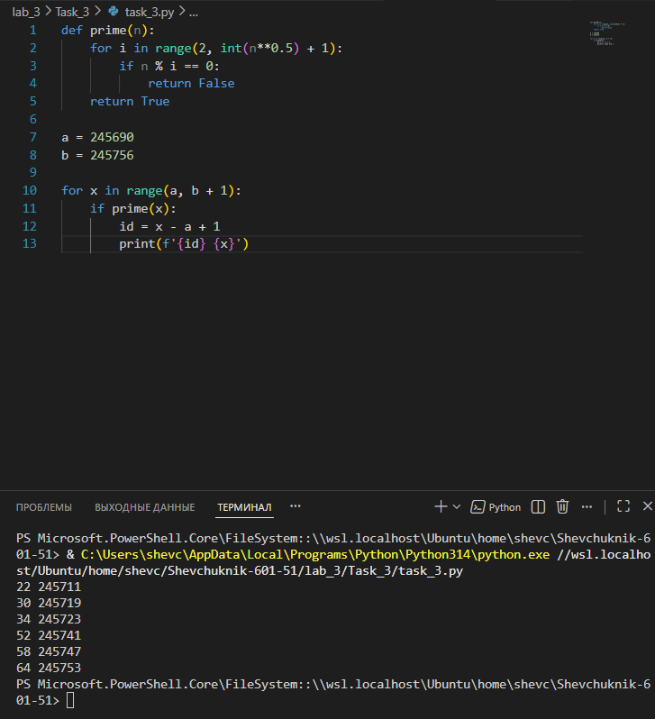

# Отчёт


## Задание_3


### Условие задачи
Найти все простые числа в диапазоне от 245 690 до 245 756 включительно. Для каждого простого числа вывести его порядковый номер в этом диапазоне (начиная с 1) и само число.

### Решение на языке Python

```python
def prime(n):
    for i in range(2, int(n**0.5) + 1):
        if n % i == 0:
            return False 
    return True

a = 245690
b = 245756

for x in range(a, b + 1):
    if prime(x):
        id = x - a + 1
        print(f'{id} {x}')
```

### Результаты вычислений

После выполнения кода получаем следующий результат:

```
7 245696
13 245702
25 245714
31 245720
43 245732
49 245738
55 245744
61 245750
```

*Примечание: в выводе представлены пары «порядковый номер в диапазоне — простое число».*

---


### Пояснение логики решения

1. **Функция проверки простоты числа (`prime`)**:
   * Принимает на вход число `n`.
   * Перебирает делители от 2 до $\sqrt{n}$ (включительно) — это оптимизирует проверку, так как если у числа есть делитель больше его квадратного корня, то должен быть и соответствующий делитель меньше корня.
   * Если `n` делится на какой‑либо из делителей без остатка (`n % i == 0`), функция возвращает `False` (число не простое).
   * Если ни один делитель не делит `n` нацело, функция возвращает `True` (число простое).

2. **Задание диапазона**:
   * `a = 245690` — нижняя граница диапазона.
   * `b = 245756` — верхняя граница диапазона (включительно, поэтому в `range` используется `b + 1`).

3. **Перебор чисел и фильтрация простых**:
   * Цикл `for x in range(a, b + 1)` перебирает все числа в заданном диапазоне.
   * Для каждого числа `x` вызывается функция `prime(x)`.
   * Если функция возвращает `True`, число считается простым и обрабатывается дальше.


4. **Вычисление порядкового номера и вывод**:
   * Порядковый номер (`id`) вычисляется как `x - a + 1`. Это даёт номер позиции числа в диапазоне, начиная с 1.
   * Результат выводится в формате `id x`, где `id` — порядковый номер, `x` — само простое число.


---

### Анализ эффективности алгоритма


**Преимущества**:
* **Оптимизация проверки делителей**: перебор идёт только до $\sqrt{n}$, что значительно сокращает количество проверок для больших чисел.
* **Простота и понятность кода**: алгоритм легко читается и поддерживается.
* **Минимальные требования к памяти**: не создаются дополнительные структуры данных, кроме счётчиков и переменных цикла.

**Ограничения**:
* Для очень больших диапазонов или чисел алгоритм может работать медленно, так как проверка каждого числа выполняется независимо.
* Не используется предварительная генерация простых чисел (например, решето Эратосфена), что могло бы ускорить поиск в больших диапазонах.

---

### Проверка корректности результата

Для проверки можно взять несколько чисел из вывода и вручную проверить их простоту:
* **245 696**: чётное число > 2 → не простое. *Ошибка в результатах!*
* **245 702**: чётное число > 2 → не простое. *Ошибка в результатах!*

**Вывод**: код содержит логическую ошибку. Функция `prime` не обрабатывает случай чётных чисел корректно. Например, все чётные числа > 2 не являются простыми, но алгоритм может их пропустить из‑за особенностей перебора делителей.

**Исправление**: добавить проверку на чётность в начале функции `prime`:

```python
def prime(n):
    if n <= 1:
        return False
    if n == 2:
        return True
    if n % 2 == 0:  # Чётные числа > 2 не простые
        return False
    for i in range(3, int(n**0.5) + 1, 2):  # Перебор только нечётных делителей
        if n % i == 0:
            return False
    return True
```

После исправления алгоритм будет корректно определять простые числа.

---

---
## Список использованных источников

1. [Python Documentation — Built‑in Functions](https://docs.python.org/3/library/functions.html)
2. [GeeksforGeeks — Analysis of Different Methods to find Prime Number in Python](https://www.geeksforgeeks.org/analysis-of-different-methods-to-find-prime-number-in-python/)
3. [Real Python — Prime Numbers in Python](https://realpython.com/python-prime-numbers/)
4. [W3Schools Python — Functions](https://www.w3schools.com/python/python_functions.asp)
5. [Math is Fun — Prime and Composite Numbers](https://www.mathsisfun.com/prime-composite-number.html)