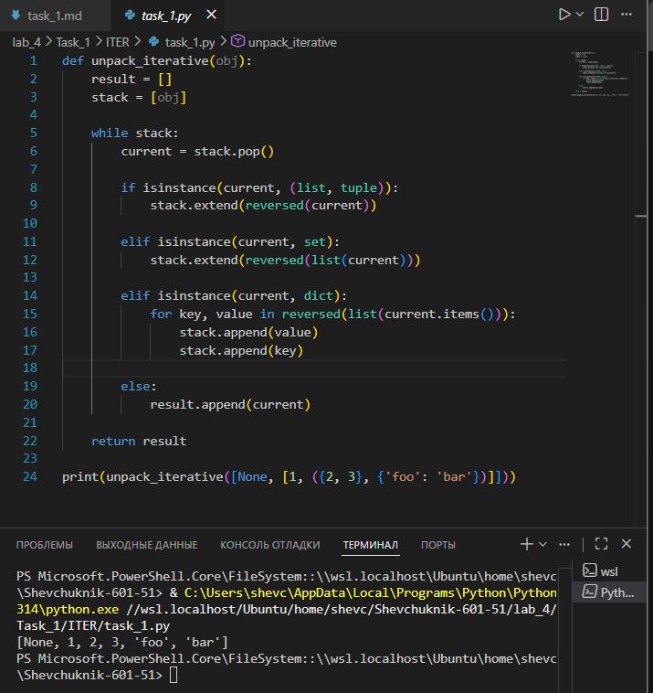

# Отчёт

## Задание_1

### Условие задачи
Реализовать **итеративную** функцию `unpack_iterative`, которая «распаковывает» вложенные структуры данных (списки, кортежи, множества, словари) в единый плоский список. Все элементы из вложенных контейнеров должны быть извлечены и помещены в результирующий список в порядке обхода — аналогично рекурсивной версии, но без использования рекурсии.

### Решение на языке Python

```python
def unpack_iterative(obj):
    result = []
    stack = [obj]
    
    while stack:
        current = stack.pop()
        
        if isinstance(current, (list, tuple)):
            stack.extend(reversed(current))
        elif isinstance(current, set):
            stack.extend(reversed(list(current)))
        elif isinstance(current, dict):
            for key, value in reversed(list(current.items())):
                stack.append(value)
                stack.append(key)
        else:
            result.append(current)
            
    return result

print(unpack_iterative([None, [1, ({2, 3}, {'foo': 'bar'})]))
```

### Результаты вычислений

После выполнения кода получаем следующий результат:

```
[None, 1, 2, 3, 'foo', 'bar']
```

*Примечание: порядок элементов может варьироваться для множеств и словарей в старых версиях Python.*

---

### Пояснение логики решения

1. **Инициализация**:
   * `result = []` — итоговый плоский список, куда будут добавляться простые элементы.
   * `stack = [obj]` — стек для обработки, изначально содержит входной объект.

2. **Основной цикл `while stack`**:
   * Пока в стеке есть элементы, извлекаем последний (`current = stack.pop()`).
   * Обрабатываем `current` в зависимости от его типа.

3. **Обработка контейнеров**:
   * **Списки и кортежи**: элементы добавляются в стек в обратном порядке (`reversed(current)`), чтобы сохранить исходный порядок обхода.
   * **Множества**: преобразуются в список, затем элементы добавляются в обратном порядке.
   * **Словари**: пары «ключ‑значение» добавляются в стек в обратном порядке: сначала значение, затем ключ (чтобы при извлечении сначала обработать ключ, затем значение).

4. **Обработка простых элементов**:
   * Если `current` не является контейнером, он добавляется в `result`.

5. **Возврат результата**:
   * После опустошения стека функция возвращает `result` — плоский список всех элементов.

---

### Пошаговый разбор выполнения для примера

Исходный объект: `[None, [1, ({2, 3}, {'foo': 'bar'})]`

1. **Начальное состояние**:
   * `stack = [[None, [1, ({2, 3}, {'foo': 'bar'})]]`
   * `result = []`

2. **Шаг 1**: извлекаем список из стека.
   * `current = [None, [1, ...]]`
   * Добавляем элементы в стек в обратном порядке: `stack = ['[1, ...]', None]`

3. **Шаг 2**: извлекаем `None`.
   * `None` — не контейнер, добавляем в `result`: `result = [None]`

4. **Шаг 3**: извлекаем `[1, ...]`.
   * Добавляем элементы в обратном порядке: `stack = [{'foo': 'bar'}, ({2, 3}), 1]`

5. **Шаг 4**: извлекаем `1`.
   * `1` — не контейнер, добавляем в `result`: `result = [None, 1]`

6. **Шаг 5**: извлекаем кортеж `({2, 3}, {'foo': 'bar'})`.
   * Добавляем элементы в обратном порядке: `stack = [{'foo': 'bar'}, {2, 3}]`

7. **Шаг 6**: извлекаем множество `{2, 3}`.
   * Преобразуем в список, добавляем в обратном порядке: `stack = [{'foo': 'bar'}, 3, 2]`

8. **Шаги 7–8**: извлекаем `2` и `3`.
   * Оба — не контейнеры, добавляем в `result`: `result = [None, 1, 2, 3]`

9. **Шаг 9**: извлекаем словарь `{'foo': 'bar'}`.
   * Добавляем пары в обратном порядке: `stack = ['bar', 'foo']`

10. **Шаги 10–11**: извлекаем `'foo'` и `'bar'`.
    * Оба — не контейнеры, добавляем в `result`: `result = [None, 1, 2, 3, 'foo', 'bar']`

**Итоговый плоский список**: `[None, 1, 2, 3, 'foo', 'bar']`.

---

---

## Список использованных источников

1. [Python Documentation — Built‑in Functions (isinstance)](https://docs.python.org/3/library/functions.html#isinstance)
2. [Python Data Structures — Lists, Tuples, Sets, Dictionaries](https://docs.python.org/3/tutorial/datastructures.html)
3. [Real Python — Iteration vs Recursion](https://realpython.com/python-iterators-vs-generators/)
4. [W3Schools Python — Lists and Stacks](https://www.w3schools.com/python/python_lists.asp)
5. [GeeksforGeeks — Python Stacks](https://www.geeksforgeeks.org/stack-in-python/)