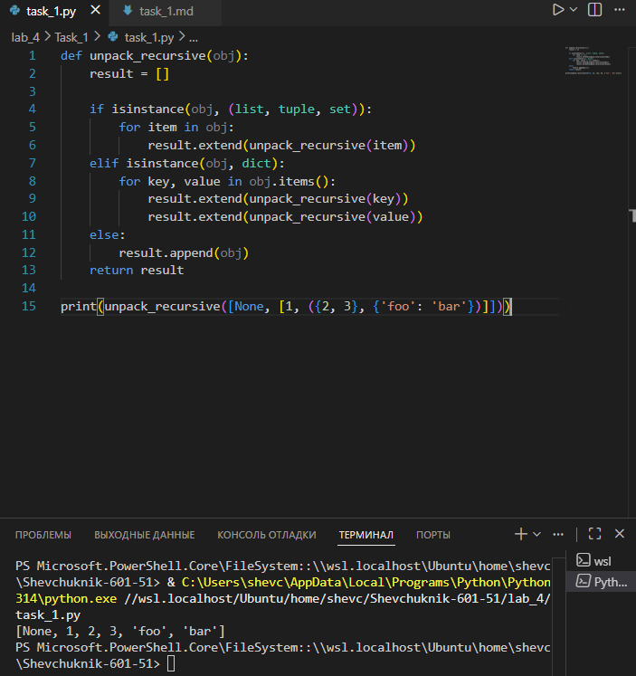

# Отчёт

## Задание_1

### Условие задачи
Реализовать рекурсивную функцию `unpack_recursive`, которая «распаковывает» вложенные структуры данных (списки, кортежи, множества, словари) в единый плоский список. Все элементы из вложенных контейнеров должны быть извлечены и помещены в результирующий список в порядке обхода.

### Решение на языке Python

```python
def unpack_recursive(obj):
    result = []

    if isinstance(obj, (list, tuple, set)):
        for item in obj:
            result.extend(unpack_recursive(item))
    elif isinstance(obj, dict):
        for key, value in obj.items():
            result.extend(unpack_recursive(key))
            result.extend(unpack_recursive(value))
    else:
        result.append(obj)
    return result

print(unpack_recursive([None, [1, ({2, 3}, {'foo': 'bar'})]]))
```

### Результаты вычислений

После выполнения кода получаем следующий результат:

```
[None, 1, 2, 3, 'foo', 'bar']
```

---

### Пояснение логики решения

1. **Базовый случай рекурсии**:
   * Если объект не является контейнером (не список, кортеж, множество или словарь), он добавляется в результат напрямую (`result.append(obj)`).
   * Это обрабатывает простые типы данных: числа, строки, `None` и т. д.

2. **Обработка списков, кортежей и множеств**:
   * Проверяется принадлежность объекта к типам `list`, `tuple` или `set` с помощью `isinstance(obj, (list, tuple, set))`.
   * Для каждого элемента внутри контейнера рекурсивно вызывается `unpack_recursive`.
   * Результаты рекурсивного вызова добавляются в `result` с помощью `extend()`, что позволяет «встраивать» распакованные элементы в общий список.

3. **Обработка словарей**:
   * Если объект — словарь (`isinstance(obj, dict)`), функция рекурсивно распаковывает и ключи, и значения.
   * Для каждой пары `key, value` в словаре:
     * `result.extend(unpack_recursive(key))` — распаковывает ключ (может быть сложным объектом).
     * `result.extend(unpack_recursive(value))` — распаковывает значение.

4. **Возврат результата**:
   * Функция возвращает плоский список `result`, содержащий все элементы из исходной структуры.
   
---

---
## Список использованных источников

1. [Python Documentation — Built‑in Functions (isinstance)](https://docs.python.org/3/library/functions.html#isinstance)
2. [Python Data Structures — Lists, Tuples, Sets, Dictionaries](https://docs.python.org/3/tutorial/datastructures.html)
3. [Real Python — Recursion in Python](https://realpython.com/python-recursion/)
4. [W3Schools Python — Lists and Tuples](https://www.w3schools.com/python/python_lists.asp)
5. [GeeksforGeeks — Python Dictionaries](https://www.geeksforgeeks.org/python-dictionaries/)