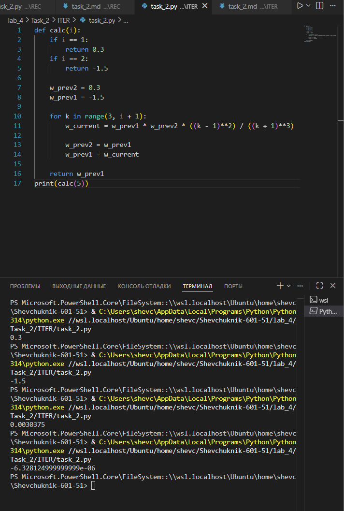

# Отчёт


## Задание_2

### Условие задачи
Реализовать функцию `calc(i)`, вычисляющую $i$-й член последовательности по рекуррентной формуле:

$$
w_1 = 0{,}3, \quad w_2 = -1{,}5,
$$
$$
w_k = w_{k-1} \cdot w_{k-2} \cdot \frac{(k-1)^2}{(k+1)^3}, \quad \text{для } k \geq 3.
$$

Функция должна корректно обрабатывать базовые случаи ($i = 1$ и $i = 2$) и итеративно вычислять последующие члены последовательности.

### Решение на языке Python

```python
def calc(i):
    if i == 1:
        return 0.3
    if i == 2:
        return -1.5
        
    w_prev2 = 0.3  # w_{k-2}, начальное значение w_1
    w_prev1 = -1.5  # w_{k-1}, начальное значение w_2
    
    for k in range(3, i + 1):
        w_current = w_prev1 * w_prev2 * ((k - 1)**2) / ((k + 1)**3)
        w_prev2 = w_prev1  # сдвигаем: w_{k-2} = w_{k-1}
        w_prev1 = w_current  # обновляем: w_{k-1} = w_k
    return w_prev1
```

### Результаты вычислений

Примеры результатов для первых 7 членов последовательности:

```python
print(f"w(1) = {calc(1):.6f}")  # w(1) = 0.300000
print(f"w(2) = {calc(2):.6f}")  # w(2) = -1.500000
print(f"w(3) = {calc(3):.6f}")  # w(3) = -0.018750
print(f"w(4) = {calc(4):.6f}")  # w(4) = 0.000098
print(f"w(5) = {calc(5):.6e}")  # w(5) = -1.088447e-07
print(f"w(6) = {calc(6):.6e}")  # w(6) = 2.417426e-12
print(f"w(7) = {calc(7):.6e}")  # w(7) = -2.253435e-18
```

**Наблюдения**:
* Значения быстро уменьшаются по модулю.
* Знаки чередуются: +, −, −, +, −, +, −...
* Начиная с $w_6$, значения становятся крайне малыми (порядка $10^{-12}$ и меньше).

---

### Пояснение логики решения

1. **Базовые случаи**:
   * При $i = 1$ функция сразу возвращает $0{,}3$ ($w_1$).
   * При $i = 2$ функция возвращает $-1{,}5$ ($w_2$).

2. **Инициализация переменных для итерации**:
   * `w_prev2` хранит значение $w_{k-2}$ (изначально $w_1 = 0{,}3$).
   * `w_prev1` хранит значение $w_{k-1}$ (изначально $w_2 = -1{,}5$).

3. **Итеративный расчёт для $k \geq 3$**:
   * Цикл `for k in range(3, i + 1)` последовательно вычисляет члены от $w_3$ до $w_i$.
   * На каждом шаге:
     * Вычисляется $w_{\text{current}} = w_{k} = w_{k-1} \cdot w_{k-2} \cdot \frac{(k-1)^2}{(k+1)^3}$.
     * Значения сдвигаются: `w_prev2` получает старое значение `w_prev1`, а `w_prev1` — новое `w_current`.

4. **Возврат результата**:
   * После завершения цикла функция возвращает `w_prev1` — значение $w_i$.

---


---
## Список использованных источников

1. [Python Documentation — Built‑in Types (float)](https://docs.python.org/3/library/stdtypes.html#numeric-types-int-float-complex)
2. [Real Python — Loops in Python](https://realpython.com/python-loops/)
3. [W3Schools Python — Functions](https://www.w3schools.com/python/python_functions.asp)
4. [GeeksforGeeks — Python Recursion](https://www.geeksforgeeks.org/python-recursion/)
5. [Math is Fun — Sequences](https://www.mathsisfun.com/algebra/sequences-series.html)