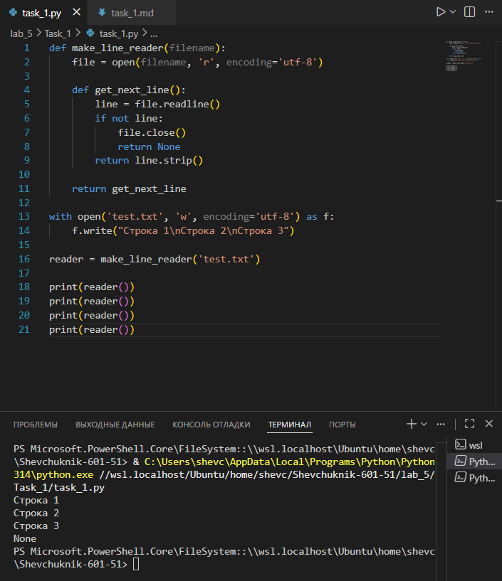

# Отчёт


## Задание_1

### Условие задачи

Реализовать функцию `make_line_reader(filename)`, которая:
* принимает имя файла в качестве аргумента;
* открывает файл для чтения;
* возвращает внутреннюю функцию `get_next_line()`, позволяющую последовательно считывать строки из файла;
* обеспечивает корректное закрытие файла после прочтения всех строк.

Дополнительно требуется:
* создать тестовый файл `test.txt` с несколькими строками текста;
* продемонстрировать работу функции на этом файле, последовательно вызывая `get_next_line()` и выводя результаты.

### Описание проделанной работы

1. **Создание тестового файла**:
   * С помощью конструкции `with open('test.txt', 'w', encoding='utf-8')` создан файл `test.txt`.
   * В файл записаны три строки текста с разделителем `\n`: «Строка 1», «Строка 2», «Строка 3».

2. **Реализация функции `make_line_reader`**:
   * Функция принимает параметр `filename` — имя файла для чтения.
   * Открывает файл в режиме чтения (`'r'`) с кодировкой UTF‑8.
   * Внутри функции определена вложенная функция `get_next_line()`, которая:
     * считывает одну строку из файла методом `file.readline()`;
     * если строка не пустая (`if not line`), возвращает её содержимое без пробельных символов по краям (`strip()`);
     * при достижении конца файла (когда `readline()` возвращает пустую строку) закрывает файл (`file.close()`) и возвращает `None`.
   * Функция `make_line_reader` возвращает ссылку на `get_next_line`, что позволяет вызывать её многократно для последовательного чтения строк.

3. **Тестирование функции**:
   * Создан объект `reader` путём вызова `make_line_reader('test.txt')`.
   * Выполнены четыре последовательных вызова `reader()`:
     * первые три вызова возвращают строки из файла: «Строка 1», «Строка 2», «Строка 3»;
     * четвёртый вызов возвращает `None`, сигнализируя о достижении конца файла.

4. **Логика работы механизма**:
   * Файл открывается один раз при создании `reader`.
   * Позиция чтения сохраняется между вызовами `reader()` благодаря замыканию (closure): внутренняя функция «помнит» объект файла.
   * После возврата `None` файл гарантированно закрыт, что предотвращает утечку ресурсов.

**Исходный код**:
```python
def make_line_reader(filename):
    file = open(filename, 'r', encoding='utf-8')
    
    def get_next_line():
        line = file.readline()
        if not line:
            file.close()
            return None
        return line.strip()
        
    return get_next_line

with open('test.txt', 'w', encoding='utf-8') as f:
    f.write("Строка 1\nСтрока 2\nСтрока 3")

reader = make_line_reader('test.txt')

print(reader())
print(reader())
print(reader())
print(reader())
```

---

### Результаты выполнения программы

**Вывод в консоли**:
```
Строка 1
Строка 2
Строка 3
None
```

**Пояснение результатов**:
* **Первый вызов `reader()`** считывает первую строку файла («Строка 1\n»), удаляет `\n` методом `strip()` и возвращает «Строка 1».
* **Второй вызов** считывает вторую строку («Строка 2\n»), возвращает «Строка 2».
* **Третий вызов** считывает третью строку («Строка 3»), возвращает «Строка 3» (символа `\n` в конце нет, так как он отсутствует в файле после последней строки).
* **Четвёртый вызов** вызывает `file.readline()`, который возвращает пустую строку `''` (конец файла). Условие `if not line` выполняется, файл закрывается, функция возвращает `None`.

---



---

## Список использованных источников

1. [Python Documentation — Input/Output](https://docs.python.org/3/tutorial/inputoutput.html)
2. [Real Python — Closures in Python](https://realpython.com/python-closures/)
3. [W3Schools Python — File Open](https://www.w3schools.com/python/python_file_open.asp)
4. [GeeksforGeeks — Python File Handling](https://www.geeksforgeeks.org/file-handling-python/)
5. [Python.org — Built‑in Functions (open)](https://docs.python.org/3/library/functions.html#open)