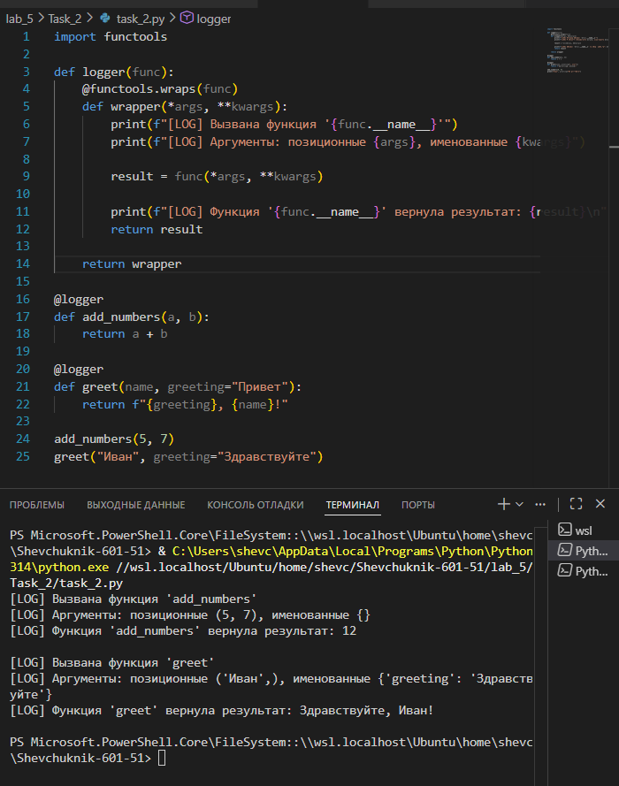

# Отчёт


## Задание_2

### Условие задачи

Реализовать декоратор `logger`, который:
* выводит информацию о вызове декорируемой функции (название, аргументы);
* выполняет функцию и получает результат;
* выводит результат выполнения функции;
* возвращает полученный результат.

Применить декоратор к двум демонстрационным функциям:
* `add_numbers(a, b)` — складывает два числа;
* `greet(name, greeting="Привет")` — формирует приветственное сообщение.

Продемонстрировать работу декоратора, вызвав декорированные функции с разными аргументами.

---

### Описание проделанной работы

1. **Реализация декоратора `logger`**:
   * Импортирован модуль `functools` для использования декоратора `@functools.wraps`.
   * Создан декоратор `logger(func)`, принимающий функцию `func` в качестве аргумента.
   * Внутри декоратора определена обёртка `wrapper(*args, **kwargs)`, которая:
     * выводит сообщение о вызове функции с указанием её имени (`func.__name__`);
     * отображает переданные позиционные (`*args`) и именованные (`**kwargs`) аргументы;
     * вызывает исходную функцию `func(*args, **kwargs)` и сохраняет результат;
     * выводит результат выполнения функции;
     * возвращает полученный результат.
   * Использован `@functools.wraps(func)` для сохранения метаданных исходной функции (имени, документации и т. д.).

2. **Применение декоратора**:
   * Декоратор `@logger` применён к функции `add_numbers(a, b)`, которая возвращает сумму двух чисел.
   * Декоратор `@logger` применён к функции `greet(name, greeting="Привет")`, которая формирует строку приветствия.

3. **Тестирование декоратора**:
   * Вызвана функция `add_numbers(5, 7)` — ожидается вывод логов и результат `12`.
   * Вызвана функция `greet("Иван", greeting="Здравствуйте")` — ожидается вывод логов и строка «Здравствуйте, Иван!».

**Исходный код**:
```python
import functools

def logger(func):
    @functools.wraps(func)
    def wrapper(*args, **kwargs):
        print(f"[LOG] Вызвана функция '{func.__name__}'")
        print(f"[LOG] Аргументы: позиционные {args}, именованные {kwargs}")
        
        result = func(*args, **kwargs)
        
        print(f"[LOG] Функция '{func.__name__}' вернула результат: {result}\n")
        return result
        
    return wrapper

@logger
def add_numbers(a, b):
    return a + b

@logger
def greet(name, greeting="Привет"):
    return f"{greeting}, {name}!"

add_numbers(5, 7)
greet("Иван", greeting="Здравствуйте")
```

---

### Результаты выполнения программы

**Вывод в консоли**:
```
[LOG] Вызвана функция 'add_numbers'
[LOG] Аргументы: позиционные (5, 7), именованные {}
[LOG] Функция 'add_numbers' вернула результат: 12

[LOG] Вызвана функция 'greet'
[LOG] Аргументы: позиционные ('Иван',), именованные {'greeting': 'Здравствуйте'}
[LOG] Функция 'greet' вернула результат: Здравствуйте, Иван!
```

**Пояснение результатов**:
* **Вызов `add_numbers(5, 7)`**:
  * Лог сообщает о вызове функции `add_numbers`.
  * Отображены позиционные аргументы `(5, 7)` и отсутствие именованных аргументов (`{}`).
  * Результат выполнения — `12`, что соответствует сумме `5 + 7`.
* **Вызов `greet("Иван", greeting="Здравствуйте")`**:
  * Лог фиксирует вызов функции `greet`.
  * Позиционный аргумент — `('Иван',)`, именованный — `{'greeting': 'Здравствуйте'}`.
  * Результат — строка «Здравствуйте, Иван!», сформированная согласно логике функции.

---



---

## Список использованных источников

1. [Python Documentation — functools](https://docs.python.org/3/library/functools.html)
2. [Real Python — Decorators in Python](https://realpython.com/python-decorators/)
3. [W3Schools Python — Decorators](https://www.w3schools.com/python/python_decorators.asp)
4. [GeeksforGeeks — Python Decorators](https://www.geeksforgeeks.org/decorators-in-python/)
5. [Python.org — Built‑in Functions (print)](https://docs.python.org/3/library/functions.html#print)