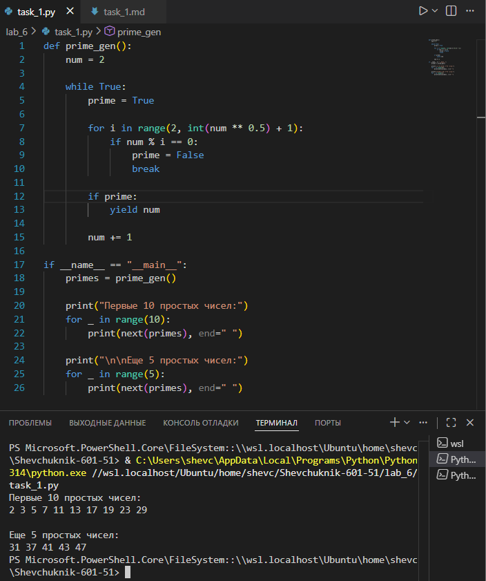

# Отчёт

## Задание_1

### Условие задачи

Реализовать генератор `prime_gen()`, который бесконечно генерирует простые числа в порядке возрастания.

Продемонстрировать работу генератора:
* вывести первые 10 простых чисел;
* затем вывести ещё 5 простых чисел (продолжая с того места, где остановились).

---

### Описание проделанной работы

1. **Реализация генератора `prime_gen()`**:
   * Функция начинается с числа `num = 2` (первое простое число).
   * Используется бесконечный цикл `while True` для генерации чисел без ограничения.
   * Для каждого числа `num` проверяется, является ли оно простым:
     * Переменная `prime` инициализируется как `True`.
     * Выполняется проверка делимости на все числа от 2 до $\sqrt{num}$ (включительно) — это оптимизирует алгоритм, так как если число имеет делитель больше своего квадратного корня, то у него есть и делитель меньше корня.
     * Если находится делитель (`num % i == 0`), `prime` устанавливается в `False`, и цикл прерывается.
   * Если число простое (`prime == True`), оно возвращается с помощью оператора `yield`. Это позволяет:
     * приостановить выполнение функции;
     * сохранить её состояние;
     * продолжить с того же места при следующем вызове `next()`.
   * Число `num` увеличивается на 1, и процесс повторяется.

2. **Тестирование генератора**:
   * Создан объект генератора `primes = prime_gen()`.
   * С помощью цикла `for` и функции `next(primes)` получены и выведены первые 10 простых чисел.
   * Затем получены и выведены ещё 5 простых чисел — генератор продолжает работу с последнего сгенерированного числа.

**Исходный код**:
```python
def prime_gen():
    num = 2

    while True:
        prime = True
        
        for i in range(2, int(num ** 0.5) + 1):
            if num % i == 0:
                prime = False
                break
                
        if prime:
            yield num
            
        num += 1

if __name__ == "__main__":
    primes = prime_gen()

    print("Первые 10 простых чисел:")
    for _ in range(10):
        print(next(primes), end=" ")
        
    print("\n\nЕще 5 простых чисел:")
    for _ in range(5):
        print(next(primes), end=" ")
```

---

### Результаты выполнения программы

**Вывод в консоли**:
```
Первые 10 простых чисел:
2 3 5 7 11 13 17 19 23 29 

Еще 5 простых чисел:
31 37 41 43 47
```

**Пояснение результатов**:
* **Первая часть** (10 чисел): генератор последовательно проверяет числа, начиная с 2, и возвращает простые: 2, 3, 5, 7, 11, 13, 17, 19, 23, 29.
* **Вторая часть** (5 чисел): генератор продолжает с числа 31 (следующего после 29) и возвращает следующие простые числа: 31, 37, 41, 43, 47.

---



---

## Список использованных источников

1. [Python Documentation — Generators](https://docs.python.org/3/tutorial/classes.html#generators)
2. [Real Python — How to Use Generators and yield in Python](https://realpython.com/introduction-to-python-generators/)
3. [W3Schools Python — Generators](https://www.w3schools.com/python/python_iterators.asp)
4. [GeeksforGeeks — Python Generators](https://www.geeksforgeeks.org/generators-in-python/)
5. [Python.org — Built‑in Functions (next)](https://docs.python.org/3/library/functions.html#next)