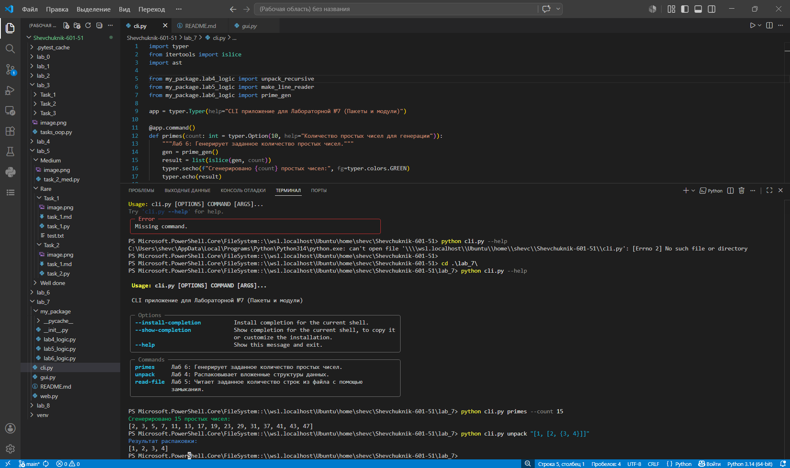
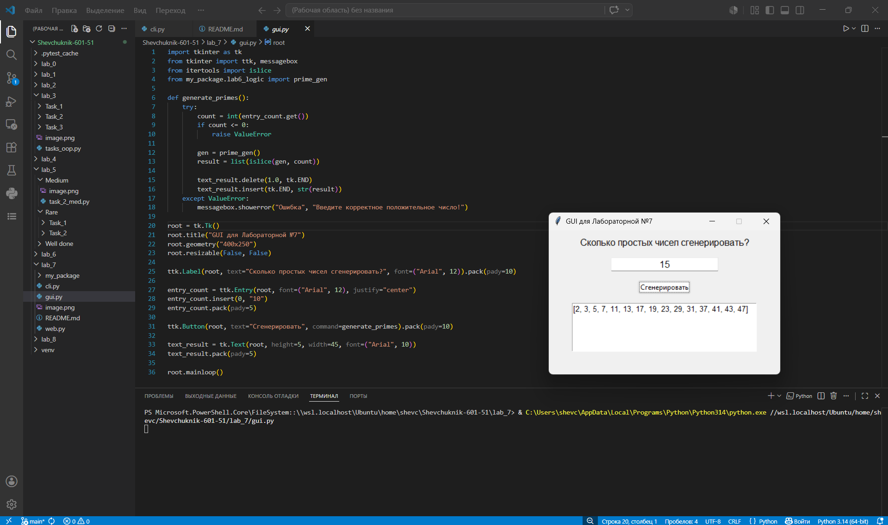
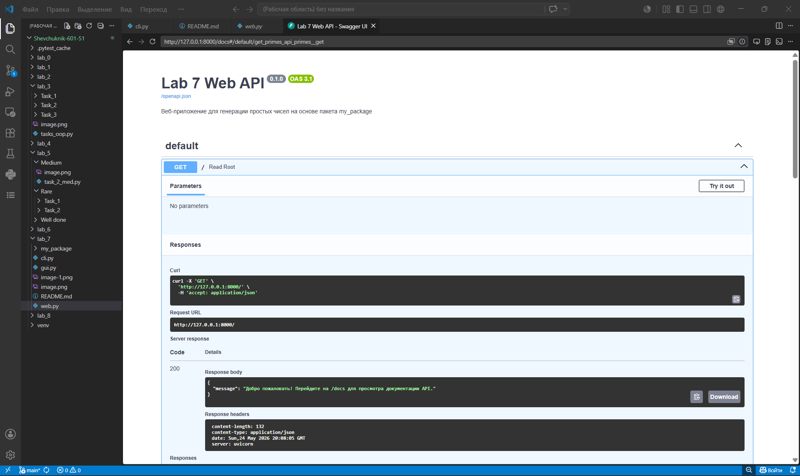
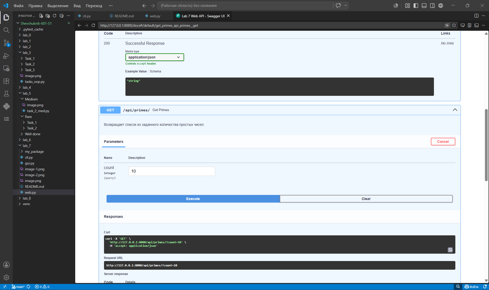
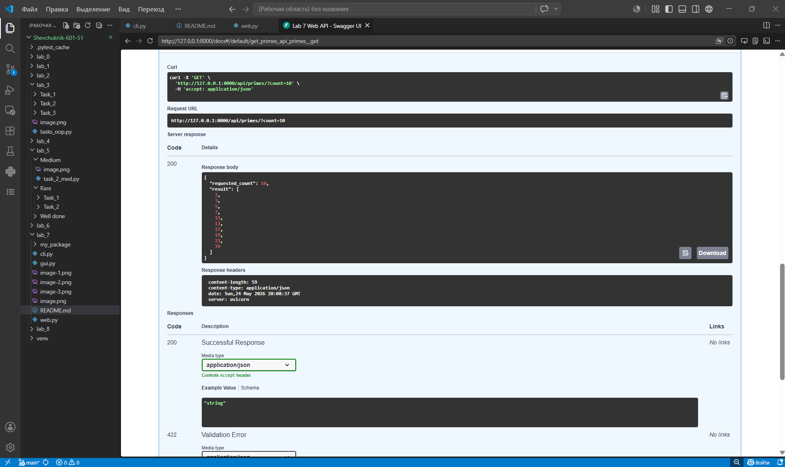
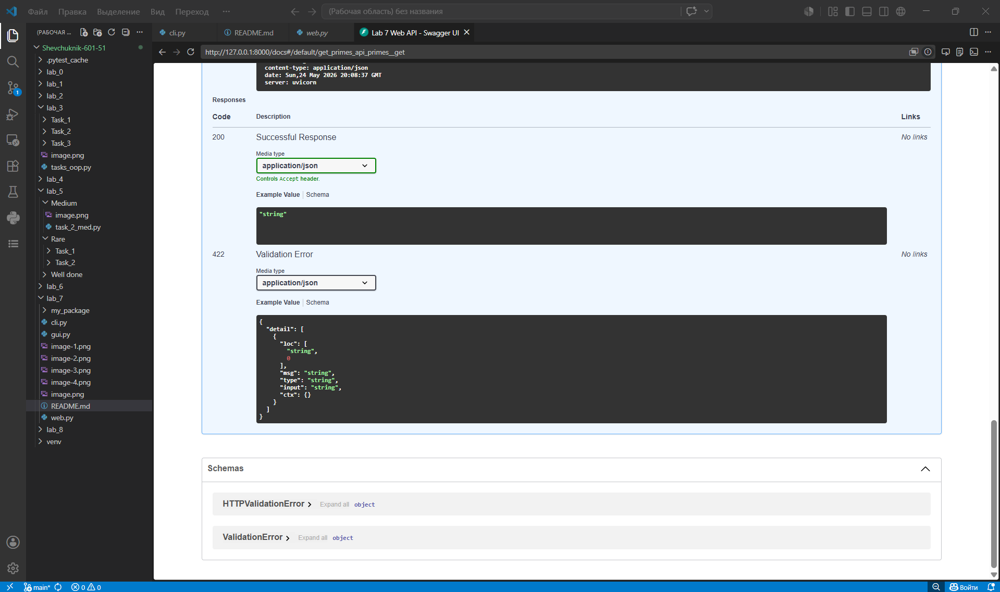
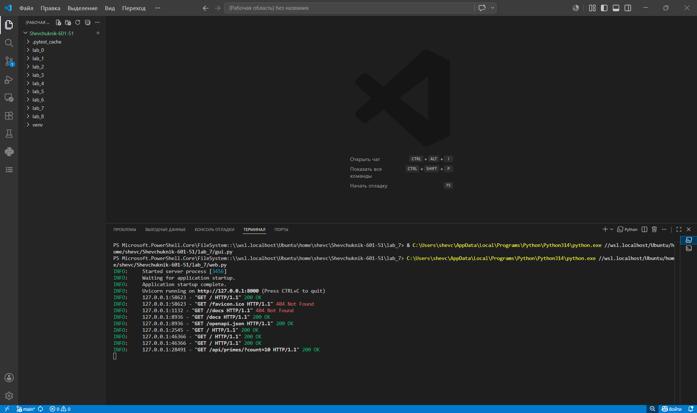

# Прог. Лабораторная работа №7: Пакеты и модули

## Условия задач
**Сложность: Rare**
1. Создайте пакет, содержащий 3 модуля на основе лабораторных работ №№ 4-6.
2. Напишите запускающий модуль на основе `Typer`, который позволит выбирать и настраивать параметры запуска логики из пакета.
3. Оформите отчёт в `README.md`.

## Описание проделанной работы
В ходе выполнения лабораторной работы был спроектирован и создан пользовательский Python-пакет `my_package`. 
Код из предыдущих лабораторных работ (№4, №5, №6) был отрефакторен: извлечена чистая бизнес-логика (функции распаковки, замыкания для чтения файлов, генераторы простых чисел) и помещена в соответствующие модули пакета (`lab4_logic.py`, `lab5_logic.py`, `lab6_logic.py`).

Для взаимодействия с пакетом был разработан консольный интерфейс (CLI) в файле `cli.py` с использованием библиотеки `Typer`. Интерфейс предоставляет пользователю три команды (`primes`, `unpack`, `read-file`), позволяя выбирать нужную логику из пакета и гибко настраивать параметры её запуска через аргументы и опции командной строки.

## Скриншоты результатов

## Ссылки на используемые материалы
- [Официальная документация Typer](https://typer.tiangolo.com/)
- [Документация Python: Модули и пакеты](https://docs.python.org/3/tutorial/modules.html)
- [Документация модуля ast (literal_eval)](https://docs.python.org/3/library/ast.html#ast.literal_eval)