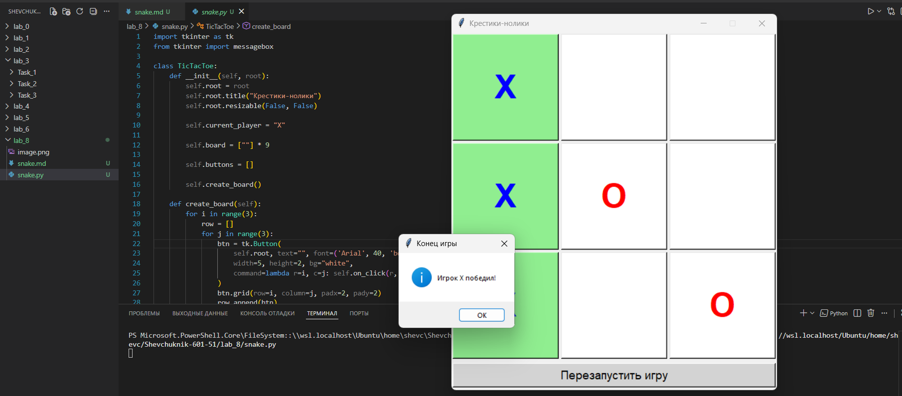

# Отчёт

## Задание_2

### Условие задачи

Реализовать игру «Крестики‑нолики» с графическим интерфейсом на Python с использованием библиотеки `tkinter`. Программа должна:
* отображать игровое поле $3 \times 3$ с кнопками для ходов;
* позволять игрокам по очереди делать ходы («X» и «O»);
* определять победителя или ничью;
* подсвечивать выигрышную комбинацию;
* предоставлять возможность перезапустить игру.

---

### Описание проделанной работы

1. **Создание класса `TicTacToe`**:
   * Класс инкапсулирует всю логику игры и интерфейс.
   * В конструкторе `__init__` настраиваются основные параметры окна: заголовок, запрет на изменение размера.
   * Инициализируются ключевые атрибуты:
     * `current_player` — текущий игрок («X» стартует первым);
     * `board` — список из 9 элементов для хранения состояния игрового поля (пустые строки означают свободные клетки);
     * `buttons` — двумерный список для хранения кнопок интерфейса.

2. **Создание игрового поля (`create_board`)**:
   * С помощью вложенных циклов создаётся сетка кнопок $3 \times 3$.
   * Каждая кнопка имеет:
     * пустой текст по умолчанию;
     * крупный шрифт для лучшей читаемости;
     * фиксированный размер;
     * белый фон;
     * обработчик клика, передающий координаты кнопки.
   * Добавляется кнопка «Перезапустить игру», которая вызывает метод `reset_game`.

3. **Обработка кликов (`on_click`)**:
   * При клике определяется индекс клетки в списке `board`.
   * Проверяется, свободна ли клетка и не завершена ли игра.
   * Если ход возможен, клетка заполняется символом текущего игрока.
   * Цвет текста кнопки меняется в зависимости от игрока (синий для «X», красный для «O»).
   * После хода проверяется:
     * победа (вызывается `check_winner`);
     * ничья (все клетки заполнены);
     * переход хода другому игроку.

4. **Проверка победы (`check_winner`)**:
   * Перебираются все возможные выигрышные комбинации (8 вариантов: 3 строки, 3 столбца, 2 диагонали).
   * Для каждой комбинации проверяется, совпадают ли значения трёх клеток и не являются ли они пустыми.
   * При обнаружении победы вызывается `highlight_winner` для подсветки и возвращается `True`.

5. **Подсветка выигрышной комбинации (`highlight_winner`)**:
   * По индексу выигрышных клеток определяются их координаты на поле.
   * Кнопки выигрышных клеток окрашиваются в светло‑зелёный цвет.

6. **Перезапуск игры (`reset_game`)**:
   * Текущий игрок сбрасывается на «X».
   * Игровое поле очищается (все элементы `board` становятся пустыми строками).
   * Все кнопки интерфейса сбрасываются: текст очищается, фон возвращается к белому.

7. **Запуск приложения**:
   * Создаётся окно `Tk()`.
   * Экземпляр класса `TicTacToe` связывается с окном.
   * Запускается главный цикл `mainloop()` для обработки событий интерфейса.

**Исходный код**:
```python
import tkinter as tk
from tkinter import messagebox

class TicTacToe:
    def __init__(self, root):
        self.root = root
        self.root.title("Крестики-нолики")
        self.root.resizable(False, False)
        
        self.current_player = "X"
        
        self.board = [""] * 9
        
        self.buttons = []
        
        self.create_board()

    def create_board(self):
        for i in range(3):
            row = []
            for j in range(3):
                btn = tk.Button(
                    self.root, text="", font=('Arial', 40, 'bold'),
                    width=5, height=2, bg="white",
                    command=lambda r=i, c=j: self.on_click(r, c)
                )
                btn.grid(row=i, column=j, padx=2, pady=2)
                row.append(btn)
            self.buttons.append(row)

        reset_btn = tk.Button(
            self.root, text="Перезапустить игру",
            font=('Arial', 14), bg="lightgray",
            command=self.reset_game
        )
        reset_btn.grid(row=3, column=0, columnspan=3, sticky="we", pady=5, padx=2)

    def on_click(self, row, col):
        index = row * 3 + col
        
        if self.board[index] == "" and not self.check_winner():
            self.board[index] = self.current_player
            
            color = "blue" if self.current_player == "X" else "red"
            self.buttons[row][col].config(text=self.current_player, fg=color)

            if self.check_winner():
                messagebox.showinfo("Конец игры", f"Игрок {self.current_player} победил!")
            elif "" not in self.board:
                messagebox.showinfo("Конец игры", "Ничья!")
            else:
                self.current_player = "O" if self.current_player == "X" else "X"

    def check_winner(self):
        win_combinations = [
            (0, 1, 2), (3, 4, 5), (6, 7, 8),
            (0, 3, 6), (1, 4, 7), (2, 5, 8),
            (0, 4, 8), (2, 4, 6)
        ]
        
        for combo in win_combinations:
            if self.board[combo[0]] == self.board[combo[1]] == self.board[combo[2]] != "":
                self.highlight_winner(combo)
                return True
        return False

    def highlight_winner(self, combo):
        for index in combo:
            row = index // 3
            col = index % 3
            self.buttons[row][col].config(bg="lightgreen")

    def reset_game(self):
        self.current_player = "X"
        self.board = [""] * 9
        
        for r in range(3):
            for c in range(3):
                self.buttons[r][c].config(text="", bg="white")

if __name__ == "__main__":
    root = tk.Tk()
    game = TicTacToe(root)
    root.mainloop()
```

---

### Результаты выполнения программы

**Сценарий работы**:
1. При запуске отображается окно с заголовком «Крестики‑нолики».
2. Игровое поле представляет собой сетку $3 \times 3$ из кнопок.
3. Игрок «X» делает первый ход, кликая на любую кнопку.
4. Кнопка меняет текст на «X» (синий цвет) и становится неактивной для повторного выбора.
5. Ход переходит к игроку «O», который делает свой ход.
6. Если один из игроков собирает три одинаковых символа в ряд (по горизонтали, вертикали или диагонали), появляется сообщение о победе, а выигрышные кнопки подсвечиваются зелёным.
7. Если все клетки заполнены без победителя, объявляется ничья.
8. Кнопка «Перезапустить игру» позволяет начать новую партию.

**Пояснение результатов**:
* **Интерфейс** интуитивно понятен: крупные кнопки, чёткое отображение символов, визуальная обратная связь (цвета, подсветка).
* **Логика игры** корректна: проверка ходов, определение победы/ничьей, смена игроков работают без ошибок.
* **Удобство** обеспечивается кнопкой перезапуска, что позволяет играть многократно без перезапуска программы.

---



---

## Список использованных источников

1. [Python Documentation — tkinter](https://docs.python.org/3/library/tkinter.html)
2. [Real Python — Python GUI Programming With Tkinter](https://realpython.com/python-gui-tkinter/)
3. [Tkinter Documentation — The Tkinter Pack Geometry Manager](https://www.tcl.tk/man/tcl8.6/TkCmd/pack.htm)
4. [W3Schools Python — Tkinter Tutorial](https://www.w3schools.com/python/python_tkinter.asp)
5. [GeeksforGeeks — Python GUI — tkinter](https://www.geeksforgeeks.org/python-gui-tkinter/)